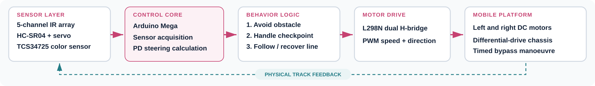

# Arduino Mega Line-Follower and Obstacle-Avoidance Robot


A team-built differential-drive robot integrating line tracking, forward-obstacle detection, bypass-direction selection, line reacquisition, and colored checkpoint handling on an Arduino Mega 2560.

This repository documents **Tinhinene Boumerdassi's embedded-development contribution**: sensor integration, discrete PD steering, motor-control logic, behavior arbitration, obstacle-scanning sequences, and firmware consolidation.

## Project at a glance

| Area | Implemented system |
| --- | --- |
| Controller | Arduino Mega 2560 |
| Line sensing | Five-channel digital IR reflectance array |
| Obstacle sensing | HC-SR04 ultrasonic sensor mounted on a scanning servo |
| Checkpoint sensing | TCS34725 RGB color sensor over I2C |
| Motor drive | L298N dual H-bridge with PWM speed control |
| Mobile base | Two-wheel differential drive |
| Control | Weighted line-position estimate with discrete PD steering |
| Validation | Integrated physical prototype testing |

## Implemented behavior

- Estimates lateral track error from five weighted IR sensors.
- Applies proportional and derivative correction to the left and right wheel PWM commands.
- Searches in the last known line direction when all line sensors lose the track.
- Stops when an obstacle is detected within the configured threshold.
- Scans left and right, selects the clearer side, executes a timed bypass, and searches for the track.
- Detects red, green, and blue checkpoints and applies the configured stop duration.
- Uses explicit behavior priority: obstacle response, detour recovery, checkpoint handling, then normal line following.
- Continues line-following operation if the optional color sensor is not detected at startup.

## System architecture



The firmware keeps the sensing, decision, and actuation flow on the microcontroller. Motor speed and direction are applied through the L298N, while movement of the physical platform closes the line-tracking feedback loop.

## Behavior priority

| Priority | State | Main action |
| ---: | --- | --- |
| 1 | Obstacle detected | Stop, scan both sides, select a detour and reacquire the line |
| 2 | Detour recovery | Search cautiously until a line sensor becomes active |
| 3 | Colored checkpoint | Stop for the programmed duration |
| 4 | Normal operation | Follow the line using PD wheel-speed correction |

## Pin assignment

| Function | Arduino Mega pin(s) |
| --- | --- |
| Left motor direction | 2, 3 |
| Right motor direction | 4, 5 |
| Left/right motor PWM | 6, 11 |
| Five IR line sensors | 7, 8, 9, 10, 12 |
| HC-SR04 trigger/echo | 13, A0 |
| Scanning servo signal | A1 |
| TCS34725 I2C | SDA 20, SCL 21 |

The pin map reflects the consolidated firmware in this repository. Confirm every connection against the physical robot before applying power.

## Repository structure

```text
.
├── README.md
├── firmware/
│   └── autonomous_line_follower_robot/
│       └── autonomous_line_follower_robot.ino
└── docs/
    ├── architecture.svg
    ├── hardware-and-calibration.md
    └── images/
        └── robot-prototype.png
```

## Build and upload

1. Install the Arduino IDE.
2. Install **Adafruit TCS34725** from the Library Manager. `Wire` and `Servo` are supplied with the Arduino platform.
3. Open `firmware/autonomous_line_follower_robot/autonomous_line_follower_robot.ino`.
4. Select **Arduino Mega or Mega 2560** and the correct serial port.
5. Verify the wiring and motor supply, then compile and upload.
6. Open the Serial Monitor at **9600 baud** for startup, obstacle, and recovery messages.

Detailed commissioning guidance is provided in [Hardware and calibration](docs/hardware-and-calibration.md).

## Parameters requiring physical calibration

- IR sensor polarity and physical ordering
- Base, search, turn, and detour PWM values
- PD gains (`LINE_KP` and `LINE_KD`)
- Ultrasonic stop distance
- Servo center, left, and right angles
- Timed turn and obstacle-bypass durations
- TCS34725 clear-channel and color-dominance thresholds

## Validation boundary

The supplied evidence supports an integrated physical prototype and implementation of the documented behaviors. No repeatable measurements for tracking error, maximum speed, obstacle-clearance accuracy, or completion rate were available; this repository therefore makes no quantitative performance claim. The current bypass depends on calibrated timing and is sensitive to battery voltage, motor mismatch, wheel slip, and surface conditions.

## Proposed architecture evolution — not implemented

- Add wheel encoders and an IMU for closed-loop speed and turn-angle control.
- Move the firmware to an STM32G4 timer-driven state machine with watchdog supervision and explicit fault recovery.
- Replace the scanning ultrasonic arrangement with solid-state multi-zone time-of-flight ranging.
- Use a calibrated analog reflectance array for more robust track-position estimation.

Line following and safety-related motor actuation should remain deterministic on the microcontroller; this task does not require AI.

## Author

**Tinhinene Boumerdassi** — Embedded Systems & Robotics Engineer

[Portfolio](https://tina-boumerdassi-portfolio.framer.website/) · [LinkedIn](https://www.linkedin.com/in/tinhineneboumerdassi/) · [GitHub](https://github.com/tinaboum)

## Project status

Archived prototype documentation. The reconstructed firmware should be bench-tested and recalibrated on the original hardware before further operation.
